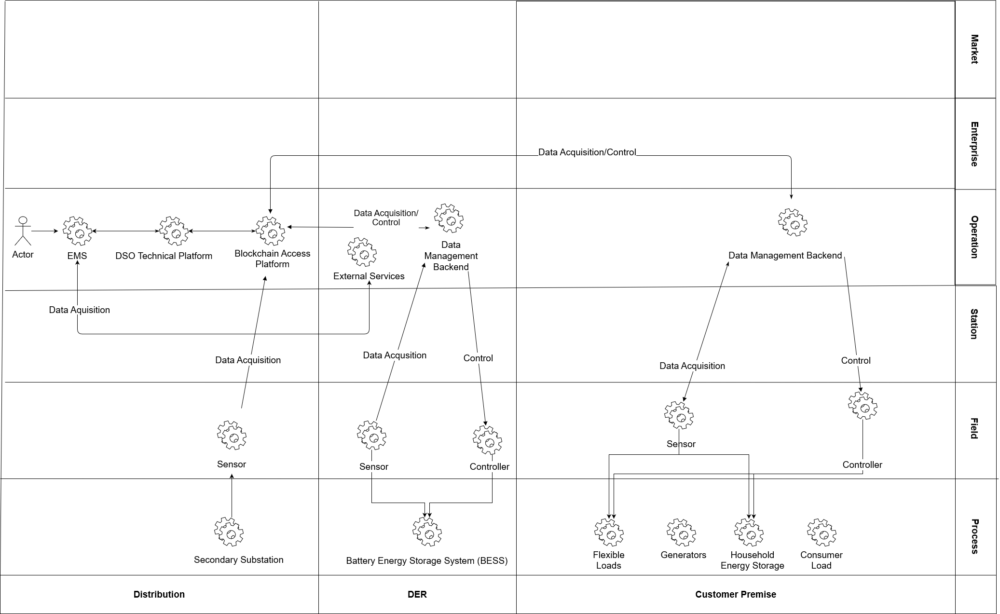

# 1. Description of the Use Case

## 1.1. Name of the Use Case

*Use case identification*

| ID  | Area /Domain(s)/Zone(s)| Name of the Use Case |
| --- | ---                    | ---                  |
| UC-DE-4| **Area:** Energy system   **Domain:** Distribution, Customer Premise, Field, DER   **Zones:** Operation, Enterprise, Process, Field | **Flex Provision:** Implementation of an Energy Management System that enables a local energy community to provide flexibility at request of a third party (operator) |

## 1.2. Version Management

*Version management*

|Version No.|Date     |Name of author(s)|Changes|Approval status|
|---        |---      |---              |---    |---            |
|0.1|1st April 2020|Thorsten Gross|Initial creation|Draft|
|0.2|2nd June 2020|Katarzyna Zawadzka|Initial creation in Github|Draft|
|0.3|16th June 2020|Benjamin Petters|Extended description and added technical part|Draft|

## 1.3. Scope and Objectives of Use Case

*Scope and objectives of use case*

|||
| --- | --- |
| **Scope** | Communities with a high penetration of photovoltaic systems and correspondingly high installed generation capacity can be expected to generate an energy surplus during times of peak generation and low local demand, and vice versa to run into an energy deficit during seasons of low generation. Surplus energy can be stored and shifted to times of low generation in order to satisfy temporary demand and hence increase the degree of self-sufficiency. Use Case 2 demonstrates how the flexibility required to enable a local balancing mechanism could temporarily be allocated to other uses, for example the provision of flexibility to a third party, e.g. the connecting grid operator. Use Case 2 uses the available flexibility in a given local energy community to maintain an externally defined non-zero setpoint at the point of connection.   Networks: LV, MV   Markets: None|
| **Objective(s)** | Maintain a fixed non-zero power exchange between energy community and the distribution network for a limited duration. |
| **Related business case(s)** | Integration of local energy communities in network management strategies for the stabilization and uniform utilization in distribution grid |

***Notes:***

* **Scope** - describes the aims and boundaries of the use case in a short, precise text.

* **Objective(s)** - goals of the use case, in form of bullet points and a short headline.

* **Realted business case(s)** - optional

## 1.4. Narrative of Use Case

**Short description**

Local energy communities (LEC, CEC) are likely to emerge in Europe in the near future but will most likely retain an interconnection to the distribution grid. These communities will require a large share of flexibility to enable their primary use case (islanding).   In the absence of sufficient generation and storage, the community is unlikely to be self-sufficient at all times. When generation of surplus occur, they must be exported into the distribution network. Instead of a real time energy export to the connected distribution network, energy surplus could be forecast and exported delayed as an energy package within a defined time, duration and power value for the load exchange at the LV/ MV-grid connection point. The generated energy surplus first shall be stored in local storages located within the community and be exported as an energy package delayed, when the load in the upper grid decreases. Outside of the defined periods of energy export, no power exchange shall take place, according to DE-UC1. This use case enables the DSO to reduce overall network costs, for example by gaining the ability to stagger the export of multiple communities along a single feeder, thusly reducing the factor of coincidence of peak load and peak load level accordingly.   Local energy communities (LEC, CEC) are likely to emerge in Europe in the near future but will most likely retain an interconnection to the distribution grid. These communities will require a large share of flexibility to enable their primary use case (islanding).     In the absence of sufficient generation and storage, the community is unlikely to be self-sufficient at all times. When generation of surplus occur, they must be exported into the distribution network. Instead of a real time energy export to the connected distribution network, energy surplus could be forecast and exported delayed as an energy package within a defined time, duration and power value for the load exchange at the LV/ MV-grid connection point. The generated energy surplus first shall be stored in local storages located within the community and be exported as an energy package delayed, when the load in the upper grid decreases. Outside of the defined periods of energy export, no power exchange shall take place, according to DE-UC1. This use case enables the DSO to reduce overall network costs, for example by gaining the ability to stagger the export of multiple communities along a single feeder, thusly reducing the factor of coincidence of peak load and peak load level accordingly.

**Complete description**

An operator of Avacon triggers the EMS to apply Use Case 4 and sets a schedule of target value P’Breaker for the period (t+1) for the power exchange at the grid connection point. The schedule can be defined for a duration for the next 1 to 24 hours.   The schedule contains time slots for the export of energy in which P’Breaker ≠ 0 and time slots in which no power shall be exchange along the grid connection point (P’Breaker = 0), following the principle of UC 1. During the application of UC 4 the total amount of exported energy shall meet the total amount of the residual energy surplus that the community will generate. The generated surplus will therefore have to be forecasted by the user. In times P’Breaker = 0 the generated surplus will have to be stored in local battery energy storages systems. In times P’Breaker ≠ 0, local batteries will be triggered to discharge in order to export generated surplus from LV into MV grid. To maintain the given setpoint P’Breaker deficits shall be covered by energy provided by batteries located in the local network whereas generated surplus shall be buffered in available batteries.   After the user input has been confirmed the EMS begins with the application of UC 4. The EMS receives weather forecasts provided by an external service provider and measurement values provided by sensors located at the LV/MV grid connection point, flexible assets such as BESS, household energy storages and flexible loads as well as household grid connection points. Based on the received data and historic measurements values the EMS forecasts the local generation and demands and determines the best strategy to reach and maintain the setpoint schedule by utilizing the available flexibility for the pre-defined duration.   A sensor located at the grid connection will measure the power exchange of all 3 phases with the MV grid PBreaker and provide data to the EMS. Based on the information the EMS determines deviations between PBreaker and P’Breaker and dispatches setpoints to increases or decreases the load in the grid in order to reach P’Breaker. Additionally, sensors located in private customer households will provide measurements of energy consumption and SOC/SOE of storages and provide data to the EMS. With historical measurement data and weather forecast provided by external service providers enable the EMS to predict energy generation and consumption to maximize the duration of time of maintaining P’Breaker.   In cases generation and demand cannot be balanced to reach (P’Breaker) due to a lack of available storage capacity or flexibility, the use case will be terminated.

## 1.5. Key Performance Indicatiors (KPI)

|ID   |Name   | Description   | Reference to mentioned use case objectives|
|-----|-------|---------------|-------------------------------------------|
|KPI_GE_UC4_01|Flexibility Availability|Assessment of availability of Flexibility| |
|KPI_GE_UC2_02|Responsiveness|Assessment of response times to flex requests and latencies along the use case process| |
|KPI_GE_UC2_03|Accuracy of power exchange|Assessment of the accuracy of the achievement of a given setpoint.| |

## 1.6. Use case conditions

|Assumptions| Prerequisites|
|-----------|-------------|
|Private Customer households with flexible loads and storages are organized in a local energy community with a central EMS.|Participants of the energy communities incl. flexible loads and storages are connected to a single low voltage grid (feed by a single MV/LV transformer) and are monitored and steered by an EMS.|
|The energy community needs an operator for the “Islanding” EMS.|National regulations have to be clarified who can be the service providers and who can’t (TSO, DSO, Aggregator, Retailer, Energy Service provider)|

***Notes:***

* **Assumptions** - general presumptions about conditions or system configurations (e.g. customer's consent required for some steps; simulation of TSO)

* **Prerequisites** - specify which requirements have to be met so that the basis scenario use case can be successfully accomplished.

## 1.7. Further information to the use case for classification/mapping

OPTIONAL - you can leave it blank

|Relation to other use cases|
|---------------------------|
|UC 1 as a prerequisite for islanding the community|
|**Level of depth**|
|Primary Use Case|
|**Prioritisation**|
|very important|
|**Generic, regional or national relation**|
|add text|
|**Nature of the use cases**|
|Technical|
|**Further keywords for classification**|
|add text|

***Notes:***

* **Relation to other use cases** - relation to other use cases in the same project or thematic area. Possible relation types are for instance include, extend, invoke, or associate.

* **Level of depth** - reflects the degree of specialisation of the use case. Although no common notation is settled, descriptions like high level use case, generic, detailed, or specialised use case are often used.

* **Prioritisation** - helps to rate the use cases in a project from very important to nice-to-have with labels like obligatory/mandatory or optional which have to be agreed upon beforehand.

* **Generic, regional or national relation** - for the purpose of generalisation if use case is applied to areas where restictions by law or silimiar issues occur.

* **Nature of the use cases** - describes the viewpoint and field of attention like *technical, political, business/market, test*, etc.

## 1.8. General remarks

|General remarks|
|---|
|- add text   - add text   - add text|

***Notes:***

Add any remarks which do not fit in any other category

# 2. Diagrams of Use Case

# 3. Technical Details

## 3.1. Actors

| **Actor Name** | **Actor Type** | **Actor Description** | **Further information specific to this Use Case** |
| --- | --- | --- | --- |
| Consumer Load | System | Household with a standard load profile energy consumption of a single household or energy consumer with a standard load profile of an agricultural building. | No direct measurement of energy consumption, demand not controllable (passive user). |
| Generators | System | Rooftop photovoltaic system generating energy directly correlated with solar radiation at location. | Limited controllability (can be curtailed in extreme cases). Located on customers premise and can be operated in combination with a battery storage system, for optimization of own consumption. |
| Controller | Device | Summarises all devices that are able to receive setpoints or setpoint schedules and translate them into actionable steering commands for the flexible load or storage. | |
| Sensors | Device | Devices that measure voltage, current and angle of phase or SOE or SOC in case of storages and able to communicate to external systems or devices. | Retrofit (PMU or other) or integrated |
| Battery Energy Storage System (BESS) | System | System that are demanding, storing and feeding energy to the local grid/energy community. | 300 kW/600 kWh, fully integrated in EMS and full time available for UC. |
| Household Energy Storage | System | System that are demanding, storing and feeding energy to the local grid/energy community. | Integrated in EMS and full time available for UC. |
| Flexible Loads | System | Electrical heater or eat pump used by household for generation of domestic heat. | aould be provided by customer households. |
| Weather Forecast Service Provider | External System | Provides weather forecasts for the next 24h of wind, solar radiation, cloudiness and temperature. | |
| BESS Data Management Backend | External System | Data backend provided by BESS manufacturer for storing data and providing measurement data and forwarding setpoint to BESS. | |
| Sensor & Controller Data Management Backend | External System | Cloud service of assets vendor (can be individual for different assets) storing data, providing measurement data of asset and/or interface for transmission of setpoints to asset. | Assets with different vendors, requires connection to different vendor cloud platform and backends. |
| DSO Technical Platform | System | Central Platform providing services, e.g. data storage and state estimation. Used as middleware for data acquisition and setpoint delivery of assets and sensors in the field. | Provided by RWTH. |
| Blockchain Access Platform | System | Platform for encryption and verification of data flows along the way of communication from EMS (ALF-C) to sensors and Assets in the field. | Provided by Engineering |
| EMS (ALF-C) | Component | -	Monitors local generation and demand   -	monitors available flexibility and storages   -	forecasts generation, demand and available flexibility via historic data and weather forecasts   -	Accepts use case Trigger from EMS Use Case Modul and determines and dispatches setpoints for individual assets   -	Calculates the setpoint or setpoint schedule for the EMS Controller | EMS named Avacon Local Flex Controller (EMS).     In a productive environment operator could be DSO, retailer, storage system operators or any other energy service provider. |
| Distribution System Operator (Avacon) | Person | Local grid operator (Avacon) setting use case and setting setpoint for load exchange along the grid connection point (P’Breaker) | Only in field test trial. n future done by DSO, TSO, marketer or energy service providers |

***Notes:***

* **Actor Type** - Device/ Sytem/ Person

## 3.2. References

OPTIONAL - you can leave it blank

| **No.** | **References Type** | **Reference** | **Status** | **Impact on Use Case** | **Organistaor / Organisation** | **Link** |
| --- | --- | --- | --- | --- | --- | --- |
|add text|add text|add text|add text|add text|add text|

# 4. Step by Step Analysis of Use Case

## 4.1. Overview of Scenarios

| **No.** | **Scenario Name** | **Primary Actor** | **Triggering Event** | **Pre-Condition** | **Post-Condition** |
| --- | --- | --- | --- | --- | --- |
| 1 | Increasing Residual Energy Demand | •	ALF-C   •	BESS   •	Energy Storage   •	Flexible Load   •	Generator   •	Controller | Measured load flow (export) at grid connection point (Residual generation is decreasing/residual demand is increasing) | •	Sensors and controllers are connected with EMS   •	Enough flexible loads and storages capacity are available | Demand of local flexible loads and storages will be decreased, or feed of storages into the grid will be increased in order to reach P’Breaker. |
| 2 | Decreasing Residual Energy Demand | •	ALF-C   •	BESS   •	Energy Storage   •	Flexible Load   •	Generator   •	Controller | Measured load flow at grid connection point (Residual generation is increasing/residual demand is decreasing) | •	Sensors and actuators are connected with ALF-C   •	Enough flexible loads and storages capacity are available for balancing | |

***Notes***

This part describes the possible scenarios of the use case. The scenarios should comply with the sequence diagrams in Sect. 2 of the template, so that every step describes one part of a communication or action. Apart from a normal success scenario, different failure scenarios or alternatives can be included to describe situations where preconditions are not satisfied or unwanted states are attained.

* **Primary Actor** - the first actor appearing in the scenario at the incident causing the scenario to begin.

* **Triggering Event** - the incident causing the scenario to begin.

* **Pre-Condition** - indicates which terms have to be fulfilled for the scenario to be executed.

* **Post-Condition** - indicates which terms should be valid after the scenario. TIt can also specify whether a scenario has been successfully completed or not.

## 4.2. Steps – Scenarios

**Scenario Name: No. 1 - Local generation exceeds consumption**

| **Step No.** | **Event.** | **Name of Process/ Activity** | **Description of Process/ Activity.** | **Service** | **Information Producer (Actor)** | **Information Receiver (Actor)** | **Information Exchanged** |
| --- | --- | --- | --- | --- | --- | --- | --- |
| 1 | Initiating of UC 4 | Trigger Event | Operator sets EMS (ALF-C) mode of operation to UC 4 and defines a setpoint schedule P’Breaker (t+1) for load exchange along the MV/LV feeder. | REPORT | DSO | EMS | I-01 |
| 2 | External service provider sends weather forecasts | Transmitting the data | An external service provider sends weather data and weather forecast values. | GET | External Systems | EMS | I-02 |
| 3 | EMS receives forecasting values | Forecasting of generation and demand | The EMS forecasts local generation and demand:   -	Generation based on weather forecasts   -	Load – based on weather forecast and load profiles from historic measurement data | CREATE | EMS | EMS | |
| 4 | Sensor (grid connection point in secondary substation) provides values | Transmitting the data | The local sensor located at secondary substation measures the residual power export and sends data to EMS.     If Applicable (to be clarified):     The communication will take place from the sensor via the sensor data management backend to the Blockchain Access Platform (BAP). The BAP acts as middleware for data encryption. From there the data will be forwarded to the DSO Technical Platform acting as second level middleware from where the signal is sent to the EMS.     After the trigger for provision of measurement data, the   Then data will be pushed by the sensor to the EMS every 10 seconds. | CHANGE | Sensor | EMS | I-03 |
| 5 | Local sensors provide data via Data Management Backend. | Transmitting the data | Local sensors provide measurements values and data via sensor data management backend to the EMS.     If Applicable (to be clarified):     The communication will take place from the sensor via the sensor data management backend to the Blockchain Access Platform (BAP). The BAP acts as middleware for data encryption. From there the data will be forwarded to the DSO Technical Platform acting as second level middleware from where the signal is sent to the EMS.     After the trigger for provision of measurement data, the   Then data will be pushed by the sensor to the EMS every 15 minutes. | CHANGE | Sensor | EMS | I-03 |
| 6 | All data collected | Evaluation and determination of control strategy and setpoints | Based on provided measurement data, asset key data. EMS calculates the power bandwidth of each asset available for steering (PFlex).     The EMS determines for each asset a setpoint (P’Asset) to reach P’Breaker. The determination of setpoints is repeated every 10 seconds for BESS and every 15 minutes for flexible loads and household energy storages. | CREATE | EMS | EMS | |
| 7 | Individual setpoints determined | Transmitting setpoints to controllers | The EMS sends setpoints via a data management backend to controllers to increase, decrease consumption assets (battery energy storage, household energy storage and flexible load) located in the field to increase consumption.     If Applicable (to be clarified):   The communication will take place from the EMS along the Blockchain Access Platform. The Blockchain Access Platform acts as middleware for data encryption. From there the data will be forwarded to the DSO Technical Platform acting as second level middleware from where the signal is sent to the Data Management Backend of the controller. This signal is sent every ten seconds to the BESS Management Backend and every 15 minutes to loads located at customer premise and replaces the default signal until the EMS calculates a setpoint. | EXECUTE | EMS | Controllers | I-04 |
| 8 | Setpoint send to controller | Verification of setpoint execution | The EMS compares measured values comparison of PBreaker from the grid connection point with the target values P’Breaker. In case of deviation the setpoint are redefined by walking through step numbers 2 to 10. The process is continuously repeated until the end of use case. | CREATE | Sensor | EMS | |
| 9 | End of Use Case 2 | End of Use Case 2 | The use case ends, when a user triggers another use case, or in a case of lack of flexibility to reach P’Breaker. | REPORT/CREATE | DSO or ALF-C | EMS | I-01 |

**Scenario Name: No. 2 - (name of scenario)**

| **Step No.** | **Event.** | **Name of Process/ Activity** | **Description of Process/ Activity.** | **Service** | **Information Producer (Actor)** | **Information Receiver (Actor)** | **Information Exchanged (IDs)** |
| --- | --- | --- | --- | --- | --- | --- | --- |
| 1 ||||||||
| 2 ||||||||

***Notes***

This part describes the possible scenarios of the use case. The scenarios should comply with the sequence diagrams in Sect. 2 of the template, so that every step describes one part of a communication or action. Apart from a normal success scenario, different failure scenarios or alternatives can be included to describe situations where preconditions are not satisfied or unwanted states are attained.

* **Event** - Event triggering a step, specific for that use case.

* **Name of Process/ Activity** - general classification of process/activity (e.g. data aquisition).

* **Description of Process/ Activity** - more detailed description of the step.

* **Service** - addresses the nature of the information flow. Possible: GET (The information receiver obtains information from the
information producer after an implicit request.), CREATE (The information producer creates an information object.), CHANGE (The information producer performs an update of the information at the information receiver’s.), DELETE (The information producer deletes information of the receiver.), CANCEL/CLOSE (A process is terminated.), EXECUTE (An action or service is performed.), REPORT (The information producer supplies information of its own account.), TIMER (The actor which represents both information producer
and receiver has to enforce a waiting period.), REPEAT (A number of steps has to be repeated until a break condition (stated in the field Event) is satisfied. The contemplated steps have to be added in parentheses.).

* **Information Producer and Receiver (Actor)** - actors from actor list in section 3.1

* **Information exchanged (IDs)** - ID of the information defined further in section 5

# 5. Information Exchanged

|**Information exchanged ID**|**Name of Information** | **Description of Information Exchanged** | **Protocol** |
| --- | --- | --- | --- |
| I-01 | User sets UC and variables | -	DSO sets the use case via an UI the EMS (ALF-C) to apply UC 2. The trigger signal is:   0 = stop current use case   1 = application of UC 1   2 = application of UC 2   3 = application of UC 3   4 = application of UC 4   -	DSO set via UI  a target setpoint (P’Breaker) for the load - exchange along the grid connection point. | HTTPS |
| I-02| Weather forecasts provision | -	Solar radiation (t + 24h)   -	Cloudiness (t + 24 h)   -	Temperature (t + 24 h)   -	Humidity (t + 24 h)   -	Windspeed (t + 24 h) | Rest API |
| I-03 | Measurement data provision | Sensors located at secondary substation, BESS and households push measurement data to EMS | PMU: MQTT or IEC61850   Household energy storage: MQTT or HTTP   BESS: MODBUS/TCP or IEC VPN 608770|
| I-04 | Sending of setpoint (t) or setpoint schedule (t+1) from EMS to BESS, household energy storages and flexible loads | Setpoint to increase or decrease demand/generation as static value [P] or relative value [%] or [SOC] | Household energy storage: MQTT or HTTP   BESS: MODBUS/TCP or IEC VPN 608770 |

***Notes***

* **Information exchanged ID** - unique number (I-01,I-02...) for identification

* **Requirements to information data** - optional, defined in section 6

# 6. Requirements (optional)

# 7. Common Terms and Definitions

| **Term** | **Definition** |
| --- | --- |
|||

# 8. Custom Information (optional)

| **Key** | **Value** | **Refers to Section** |
| --- | --- | --- |
|||

# 9. Functionalities

| **Function** | **Description** | **Application in UC-GE-0** | **Input** | **Output** | **Provided by** |
| --- | --- | --- | --- | --- | --- |
| F-01 | Monitoring | 1,2,3,4 | I-03 | | ALF-C |
| F-02 | Data Storage | 1,2,3,4 | I-03 | Historic data | ALF-C, BAP |
| F-03 | Analysis of historic data | 1,2,3,4 | Historic data | Load profiles | ALF-C, DSOTP |
| F-04 | State Estimation | 1,2,3,4 | I-02, I-03 | | ALF-C, DSOTP |
| F-05 | Forecasting Generation | 1,2,3,4 | I-03, I-02 asset data; load profiles | Generation forecast | ALF-C, DSOTP |
| F-06 | Forecasting Demand | 1,2,3,4 | I-03, I-02 asset data; load profiles | Load forecast | ALF-C, DSOTP |
| F-07 | Local Balancing | 1,2,3,4 | I-01, I-03, Generation forecast, Load forecast | Setpoint | ALF-C, DSOTP |
| F-08 | Setpoint Dispatching | 1,2,3,4 | Setpoint | I-06 | ALF-C |

