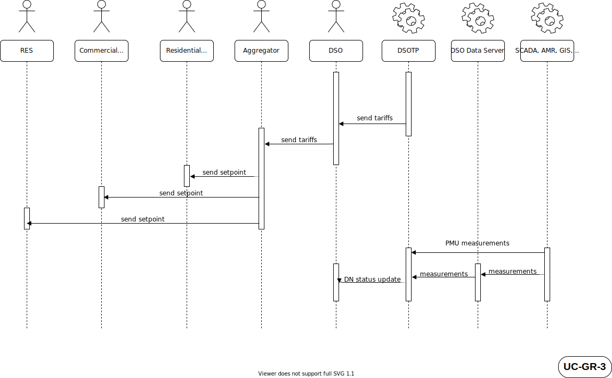

# 1. Description of the Use Case

## 1.1. Name of the Use Case

*Use case identification*

| ID  | Area /Domain(s)/Zone(s)| Name of the Use Case |
| --- | ---                    | ---                  |
| UC-GR-3| Area: Energy system   Domains: Distribution, DER, Customer Premises/   Zones: Station, Operation    | Distribution Network limit violation mitigation |

***Notes:***
* **ID** - uniqe identification label: DE-1/GR-3/IT-2
* **Area /Domain(s)/Zone(s)** - placement of the use case in the SGAM domains and zones. It can be left blank if you are not sure.

## 1.2. Version Management

*Version management*

|Version No.|Date     |Name of author(s)|Changes|Approval status|
|---        |---      |---              |---    |---            |
|0.1|17th June 2020|Panagiotis Pediaditis, Themistoklis Xygkis, Dimitris Stratogiannis, Eleni Daridou, Stavroula Tzioka|Initial creation|Draft|

## 1.3. Scope and Objectives of Use Case

*Scope and objectives of use case*

|||
| --- | --- |
| Scope | The scope of the UC is to examine the operational use of flexibility tools in order to satisfy EN50160 in case of a voltage level limit violation in the distribution network and mitigate line congestion, especially in MV lines with flexible loads availability.  |
| **Objective(s)** | *To use network tariffs in order to incentivise a more efficient operation of the network while respecting operation limits (voltages, lines)   |
| **Related business case(s)** |add text|

***Notes:***
* **Scope** - describes the aims and boundaries of the use case in a short, precise text.
* **Objective(s)** - goals of the use case, in form of bullet points and a short headline.
* **Realted business case(s)** - optional

## 1.4. Narrative of Use Case

**Short description**
Various types of flexible loads -aggregated for the scope of the Use Case- react to network tariffs sent by the DSO, so that a voltage/line thermal limit violation is mitigated.The DSO will examine the operation of tools and services for decision making support to mitigate voltage/thermal line limits violations, assuming that the grid state estimation has a good degree of certainty .

**Complete description**
Customers with flexible loads are connected to the distribution network and their loads are considered aggregated for the scope of the UCs regarding their management in the MV level. State of the network is known with a good degree of certainty based on the state vector that the state estimation tool produces using the available measurements and the topology data from the AMR, GIS, SCADA and PMUs. The DSO communicates network tariffs in a day-ahead context. These tariffs appropriately reflect the potential of the network exceeding its physical limits resulting in violations and/or curtailment of demand/generation. Compared to the business as usual scenario of the flat network tariffs, the DSO aims at reducing such negative effects by the use of variable day-ahead network tariffs, which incentivise the appropriate actions of the -assumed as- rational users of the distribution network.

add text - longer narrative from user viewpoint about *what* happens *how*, *where*, *when*, *why* and *under which assumptions*. It has to be written in a way that it can also be understood by non-experts.

## 1.5. Key Performance Indicatiors (KPI)

|ID   |Name   | Description   | Reference to mentioned use case objectives|
|-----|-------|---------------|-------------------------------------------|
|add text|add text|add text|add text|

***Notes:***
Can be left blank now

## 1.6. Use case conditions

|Assumptions| Prerequisites|
|-----------|-------------|
|Customers' consent required for participation in the flexibility mechanism, Customers are rational, Part of the load is flexible, State of the network is known with a good degree of certainty| Dynamic network charging is allowed, Smart metering is installed, Smart appliances can perform load shifting, DSO systems (e.g.AMR, GIS, SCADA) being operational|

***Notes:***
* **Assumptions** - general presumptions about conditions or system configurations (e.g. customer's consent required for some steps; simulation of TSO)
* **Prerequisites** - specify which requirements have to be met so that the basis scenario use case can be successfully accomplished.

## 1.7. Further information to the use case for classification/mapping

OPTIONAL - you can leave it blank

|Relation to other use cases|
|---------------------------|
|include uc-GR-1 and uc-GR-2|
|**Level of depth**|
|detailed|
|**Prioritisation**|
|obligatory|
|**Generic, regional or national relation**|
|generic|
|**Nature of the use cases**|
|technical, market|
|**Further keywords for classification**|
|add text|

***Notes:***
* **Relation to other use cases** - relation to other use cases in the same project or thematic area. Possible relation types are for instance include, extend, invoke, or associate.
* **Level of depth** - reflects the degree of specialisation of the use case. Although no common notation is settled, descriptions like high level use case, generic, detailed, or specialised use case are often used.
* **Prioritisation** - helps to rate the use cases in a project from very important to nice-to-have with labels like obligatory/mandatory or optional which have to be agreed upon beforehand.
* **Generic, regional or national relation** - for the purpose of generalisation if use case is applied to areas where restictions by law or silimiar issues occur.
* **Nature of the use cases** - describes the viewpoint and field of attention like *technical, political, business/market, test*, etc.

## 1.8. General remarks

|General remarks|
|---|
|- add text   - add text   - add text|

***Notes:***
Add any remarks which do not fit in any other category

# 2. Diagrams of Use Case

# 3. Technical Details

## 3.1. Actors

| **Actor Name** | **Actor Type** | **Actor Description** | **Further information specific to this Use Case** |
| --- | --- | --- | --- |
| Aggregator| Person | add text| add text|
| AMR | System | Automatic Meter Reading system|  |
| Commercial customer | Person | Final end user to denote a typical commodity commercial consumption with capability of neither generation nor storage.| |
| DMS | System | Distribution Management System | |
| DSO | Person | Distribution System Operator, the entity responsible for the safe and secure operation and management of the distribution system; for data management associated with the use of the distribution system; for procurement of flexibility services using optimization algorithms and the Platone DSO Technical Platform.  ||
| DSO Data Server | System | Database containing data from AMR, DMS & SCADA| |
| DSOTP | System | DSO Technical Platform| |
| GIS | System | Geographical Information System |  |
| PMU | Device | Phasor Measurement Unit | |
| RES | System | Renewable Energy Source| |
| Residential customer | Person | Final end user to denote a typical commodity residential consumption with capability of neither generation nor storage.| |
| SCADA | Device | Supervisory Control And Data Acquisition system|  |

***Notes:***
* **Actor Type** - Device/ Sytem/ Person

## 3.2. References

OPTIONAL - you can leave it blank

| **No.** | **References Type** | **Reference** | **Status** | **Impact on Use Case** | **Organistaor / Organisation** | **Link** |
| --- | --- | --- | --- | --- | --- | --- |
|1|Standard| EN50160 Voltage characteristics of electricity supplied by public distribution systems|add text|CENELEC|add text|

# 4. Step by Step Analysis of Use Case

## 4.1. Overview of Scenarios

| **No.** | **Scenario Name** | **Primary Actor** | **Triggering Event** | **Pre-Condition** | **Post-Condition** |
| --- | --- | --- | --- | --- | --- |
| 1 | Network limit violations mitigation by the use of day-ahead network tariffs | none | none |Distribution network observability | Network limit violation mitigated |

***Notes***
This part describes the possible scenarios of the use case. The scenarios should comply with the sequence diagrams in Sect. 2 of the template, so that every step describes one part of a communication or action. Apart from a normal success scenario, different failure scenarios or alternatives can be included to describe situations where preconditions are not satisfied or unwanted states are attained.
* **Primary Actor** - the first actor appearing in the scenario at the incident causing the scenario to begin.
* **Triggering Event** - the incident causing the scenario to begin.
* **Pre-Condition** - indicates which terms have to be fulfilled for the scenario to be executed.
* **Post-Condition** - indicates which terms should be valid after the scenario. TIt can also specify whether a scenario has been successfully completed or not.

## 4.2. Steps – Scenarios

**Scenario Name: No. 1 - Network limit violations mitigation by the use of day-ahead network tariffs **

| **Step No.** | **Event.** | **Name of Process/ Activity** | **Description of Process/ Activity.** | **Service** | **Information Producer (Actor)** | **Information Receiver (Actor)** | **Information Exchanged** | **Requirements, R-ID** |
| --- | --- | --- | --- | --- | --- | --- | --- | --- |
| 1 |none-daily process|Tariffs retrieval|Day-ahead tariffs that reflect the expected state of the network sent to the DSO|CREATE|DSOTP|DSO|I-06||
| 2 |Tariffs retrieval|Tariffs communication|Tariffs are communicated to the Aggregator|REPORT|DSO|Aggregator|I-06||
| 3 |Tariffs communication|Setpoint sent to Residential Customer| Sending setpoint to the flexibility load|CREATE|Aggregator|Residential consumer|I-07||
| 4 |Tariffs communication|Setpoint sent to Commercial Customer| Sending setpoint to the flexibility load|CREATE|Aggregator|Commercial consumer|I-07||
| 5 |Tariffs communication|Setpoint sent to RES| Sending setpoint to the RES producer|CREATE|Aggregator|RES|I-07||
| 6 |none|Data Aquisition|New Distribution Network state (Distribution Network state updated following the Aggregator's response)|REPORT|PMU|DSOTP|I-04||
| 7 |none|Data Aquisition|New Distribution Network state (Distribution Network state updated following the Aggregator's response)|REPORT|SCADA,DMS,GIS,AMR|DSO Data Server|I-01||
| 8 |New Distribution Network state|Data Aquisition|New Distribution Network state|REPORT|DSO Data Server|BAP|I-01||
| 9 |New Distribution Network state|Data Verification|All data received gets verified and secured via blockchain technology |EXECUTE|BAP|BAP|||
| 10 |New Distribution Network state|Data Acquisition| Verified and secured data is delivered to the DSOTP |REPORT|BAP|DSOTP|I-03||
| 11 |New Distribution Network state|Data Aquisition|New Distribution Network state|REPORT|DSOTP|DSO|I-02||

***Notes***
This part describes the possible scenarios of the use case. The scenarios should comply with the sequence diagrams in Sect. 2 of the template, so that every step describes one part of a communication or action. Apart from a normal success scenario, different failure scenarios or alternatives can be included to describe situations where preconditions are not satisfied or unwanted states are attained.
* **Event** - Event triggering a step, specific for that use case.
* **Name of Process/ Activity** - general classification of process/activity (e.g. data aquisition).
* **Description of Process/ Activity** - more detailed description of the step.
* **Service** - addresses the nature of the information flow. Possible: GET (The information receiver obtains information from the
information producer after an implicit request.), CREATE (The information producer creates an information object.), CHANGE (The information producer performs an update of the information at the information receiver’s.), DELETE (The information producer deletes information of the receiver.), CANCEL/CLOSE (A process is terminated.), EXECUTE (An action or service is performed.), REPORT (The information producer supplies information of its own account.), TIMER (The actor which represents both information producer
and receiver has to enforce a waiting period.), REPEAT (A number of steps has to be repeated until a break condition (stated in the field Event) is satisfied. The contemplated steps have to be added in parentheses.).
* **Information Producer and Receiver (Actor)** - actors from actor list in section 3.1
* **Information exchanged (IDs)** - ID of the information defined further in section 5

# 5. Information Exchanged

|**Information exchanged ID**|**Name of Information** | **Description of Information Exchanged** | **Protocol** |
| --- | --- | --- | --- |
|I-01|Measurements|Measurements from the Distribution Network (voltage magnitudes, active and reactive power injections/flows)|ethernet TCP/IP, IP over GPRS|
|I-02|State Vector|Voltage magnitudes and angles of all network buses||
|I-04|PMU Measurements|Measurements from PMUs (e.g. voltage magnitudes, voltage phasors, current phasors)|MQTT|
|I-06|Network tariffs|Network tariffs that reflect the Disribution Network state|IP|
|I-07|Setpoint|Setpoint for adjustment of flexible load/RES production|IP|

***Notes***
* **Information exchanged ID** - unique number (I-01,I-02...) for identification
* **Requirements to information data** - optional, defined in section 6

# 6. Requirements (optional)

# 7. Common Terms and Definitions

| **Term** | **Definition** |
| --- | --- |

# 8. Custom Information (optional)

| **Key** | **Value** | **Refers to Section** |
| --- | --- | --- |
|||
