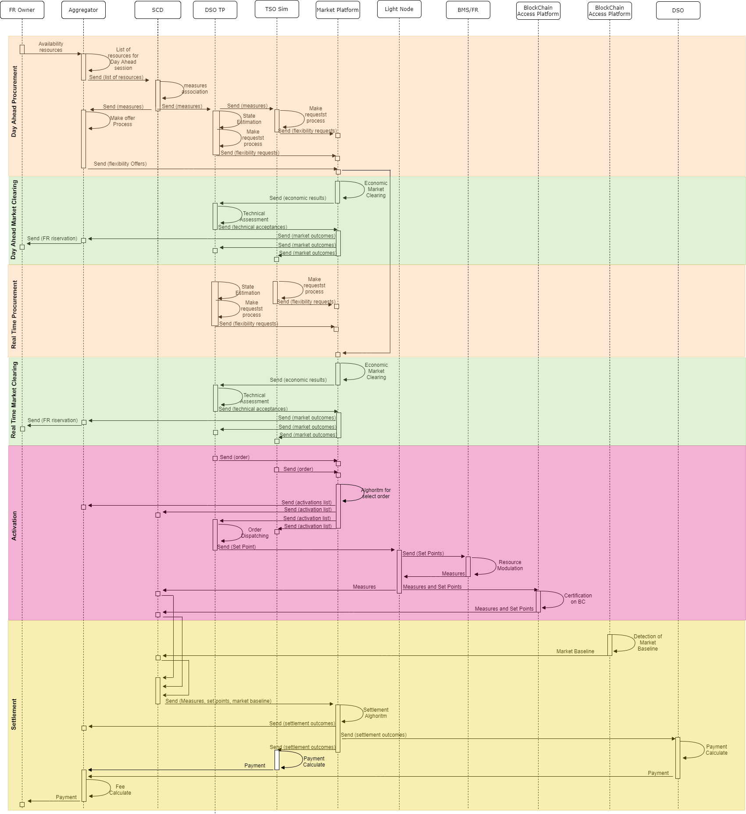

# 1. Description of the Use Case

## 1.1. Name of the Use Case

*Use case identification*
| ID  | Area /Domain(s)/Zone(s)| Name of the Use Case |
| --- | ---                    | ---                  |
| UC-IT-1| Area: Energy system   *Leave it blank if not sure* | Congestion Management in transmission and distribution system using also the resources connected to the distribution system |

## 1.2. Version Management

*Version management*
|Version No.|Date     |Name of author(s)|Changes|Approval status|
|---        |---      |---              |---    |---            |
|0.1||areti, Acea Energia, Engineering, Siemens|Initial creation||
|0.2|2nd June 2020|Katarzyna Zawadzka|Initial creation in Github|Draft|

## 1.3. Scope and Objectives of Use Case

*Scope and objectives of use case*
|||
| --- | --- |
| Scope | Voltage violations avoidance in distribution and transmission grid by use of flexibility resources connected to transmission and distribution system providing ancillary services through a market mechanism.   Networks: MV, LV (HV users have their own market)   Markets: Day Ahead, Near Real Time|
| **Objective(s)** | * To support the TSO to use the flexibility provided by the resources connected to the distribution system for congestion management, while respecting distribution system constraints   * To ensure an inclusive and non-discriminatory access to the market *for all agents that provide grid services*   * To enable coordination between system operators   * To *optimize* the distribution network utilization   * To activate *flexibility to solve voltage violations in the distribution grid*   * To *minimize RES curtailment due to technical requirements and operation constraints*|
| **Related business case(s)** |add text|

## 1.4. Narrative of Use Case

**Short description**

This BUC describes the main steps to avoid congestion in transmission and distribution systems. The DSO can use flexible resources connected to the distribution system and TSO can use flexible resources connected to transmission and distribution systems after the DSO’s approval. The power flow is assessed and monitored respectively by DSO and TSO, in order to keep the electrical quantities within admissible ranges.

**Complete description**

The UC deals the Voltage Violation on transmission and distribution grid, describing all the main phases: procurement, activation and settlement, in the day ahead and real time flexibility market.
In the day ahead market, the FR Owner sends to Aggregator Platform the list of the resources available for the day after. Subsequently the Aggregator Platform transmits the list to the SCD. For every POD, the SCD joins the quarterly measures and all the main data useful for the flexibility and sends them to DSO TP, TSO simulator and Aggregator Platform. 
In parallel take place three processes :
-	The DSO Technical Platform detects the voltage violation on the distribution grid. The DSO try first to solve the issues using the own solutions, after it uses the local flexibility market, defining the local flexibility requests;
-	The TSO simulator defines the voltage violations on the transmission network and requires the flexibility to solve the congestion in HV grid to the local market;
-	The Aggregator Platform gathers the flexibility from the customers in low and in medium voltage and offer it to the market platform.
At gate closure all the day ahead requests and offers are stored on the Market Platform. The Market Platform matches first the offers with the DSO’s requests, and orders them in economic manner, after repeats the procedure with the TSO requests. Hence the list of auctioned offers is sent to DSO TP for evaluate the grid constraints violations. Finally the market platform receives the list of offers comply with local grid constraints and sends them to all the stakeholders.
Moreover the Aggregator Platform sends a reservation to FR Owner for the resources that will be select for the market day ahead.
The same steps are followed in the Real Time session. The only variation is in the Aggregator domain. Indeed the aggregator uses in Real Time session the same offers proposed in the Day ahead market, hence all the requests that DSO and TSO makes in Real Time are matched with the offers presented in the previous session.
When the DSO or the TSO need of flexibility, begin the Activation phase, where the DSO TP or TSO Simulator communicate to market the order to move tied to a specific offer. The Market Platform sends the order to DSO TP, that divides it for every POD and dispatches the set point to light nodes. The light nodes make available the set points to the BMS/FR. Also, the Light Node measures the electrical quantities for evaluate the energy flexibility and sends them to the SCD.
For the settlement phase the Market Platform acquires the data from the SCD and calculates the difference between market baseline, uploaded in the SCD by BRP, and electrical quantities measured in the same time frame, uploaded in the SCD by Light Node. The Market Platform runs the settlement algorithm and finds the outcomes. The settlement outcomes are transmitted to Aggregator Platform, DSO and TSO Simulator.
Finally, the DSO pays the flexibility to the aggregator, that can recognizes the fee to the FR Owner.

## 1.5. Key Performance Indicators (KPI)

|ID   |Name   | Description   | Reference to mentioned use case objectives|
|-----|-------|---------------|-------------------------------------------|
|add text|add text|add text|add text|

## 1.6. Use case conditions

|Assumptions| Prerequisites|
|-----------|-------------|
|add text| add text|

***Notes:***

* **Assumptions** - general presumptions about conditions or system configurations (e.g. customer's consent required for some steps; simulation of TSO)

* **Prerequisites** - specify which requirements have to be met so that the basis scenario use case can be successfully accomplished.

## 1.7. Further information to the use case for classification/mapping

OPTIONAL - you can leave it blank

|Relation to other use cases|
|---------------------------|
|add text|
|**Level of depth**|
|add text|
|**Prioritisation**|
|add text|
|**Generic, regional or national relation**|
|add text|
|**Nature of the use cases**|
|add text|
|**Further keywords for classification**|
|add text|

***Notes:***

* **Relation to other use cases** - relation to other use cases in the same project or thematic area. Possible relation types are for instance include, extend, invoke, or associate.

* **Level of depth** - reflects the degree of specialisation of the use case. Although no common notation is settled, descriptions like high level use case, generic, detailed, or specialised use case are often used.

* **Prioritisation** - helps to rate the use cases in a project from very important to nice-to-have with labels like obligatory/mandatory or optional which have to be agreed upon beforehand.

* **Generic, regional or national relation** - for the purpose of generalisation if use case is applied to areas where restictions by law or silimiar issues occur.

* **Nature of the use cases** - describes the viewpoint and field of attention like *technical, political, business/market, test*, etc.

## 1.8. General remarks

|General remarks|
|---|
|- add text   - add text   - add text|

***Notes:***

Add any remarks which do not fit in any other category

# 2. Diagrams of Use Case

# 3. Technical Details

## 3.1. Actors

| **Actor Name** | **Actor Type** | **Actor Description** | **Further information specific to this Use Case** |
| --- | --- | --- | --- |
| DSO| Person |DSO is each Distribution System Operator. It is an entity in charge for the management of the energy distribution networks| DMS, Light Node, Shared Customer Database, Simulator of DSO flexibility requests, Blockchain access layer|
|Light Node|Device|Device installed on the electrical meter that reads, arranges, certifies in BlockChain and sends the measurement for the dispatching market to the SCD (shared customer database). Moreover the device receives set-point from DSO Platform and make it available to client on client apparatus (e.g. EMS) ||
|DSO Technical Platform|System|System that manages the distribution network. It foresees the grid state estimation, the productions and consumptions. Moreover it defines the flexibility requests for DSO’s grid. The DSO Technical Platform interfaces to SCADA and other system comprising in the Operation Domain||
|BMS|System|BMS is a computer-based control system installed in buildings that controls and monitors the building's mechanical and electrical equipment such as ventilation, lighting, power systems, fire systems, and security systems. In Italian demo the definition can also comprise the Home Management System (HMS) for residential users||
|Blockchain Access Layer|System|Platform that certifies the customer data for the flexibility||
|Shared Customer Database|System|Database that gathers all the data of flexibility resources and services and shares them with all the stakeholders||
|TSO|Person|TSO is each Transmission System Operator. It is an entity in charge for the management of the energy transmission networks|The TSO will be simulated in a tool developed in WP 2|
|TSO simulator|Software component|Tool to emulate the TSO flexibility requests that involve the resources connected in medium and in low voltage||
|Market Operator|Person|Market Operator is the responsible for the market Platform, it matches the offers and requests||
|PlatOne Market Platform|Software component|Virtual Place where the requests of flexibility match the offers||
|Flexibility Resources (FR)|System|Resources, in customer premises, that provide flexibility to the market. They could be generation plants, electric vehicles, batteries, active demand. They are closely related to the demo’s areas||
|Flexibility Resources Owner (FR Owner)|Person|FR Owner is the customer that makes available its flexibility to provide the ancillary services||
|Aggregator/Flexibility operator|Person|Aggregator / Flexibility operator is an entity that aggregates the flexibility offers on the market and provide them to DSO in case of needs for the grid|Aggregator Platform|
|Aggregator Platform/Software component|System that gathers the data measurement from the customers, calculates the energy flexibility to offer on the market, and defines the users set-points||
|Balance responsible party|Person|Balance responsible party is a market participant or its chosen representative responsible for its imbalances||

## 3.2. References

OPTIONAL - you can leave it blank

| **No.** | **References Type** | **Reference** | **Status** | **Impact on Use Case** | **Organistaor / Organisation** | **Link** |
| --- | --- | --- | --- | --- | --- | --- |
|add text|add text|add text|add text|add text|add text|

# 4. Step by Step Analysis of Use Case

## 4.1. Overview of Scenarios

| **No.** | **Scenario Name** | **Primary Actor** | **Triggering Event** | **Pre-Condition** | **Post-Condition** |
| --- | --- | --- | --- | --- | --- |
| 1 |Day Ahead|DSO|DSO assesses the Grid for the day after and finds a Voltage violation|The DSO Technical Platform is able to foresee the grid status for the day after|The DSO acquires on the market the energy flexibility to solve the grid issues for the day after|
| 2 |Real Time|DSO|DSO assesses the Grid for the next 4 hour to take in account the last grid outages or riconfiguration|The DSO TP is able to detect the critical issues in  short term|The DSO acquires on the market the energy flexibility to solve the grid issues for the real time|
| 3 |Activation|DSO|DSO sends the order to move the resources|The resources have won the session market|The Light Node measures the deviation from the baseline|
| 4 |Settlement|BRP|BRP sends the baseline to SCD|BRP estimate the baseline for the energy market| The market operator calculates the flexibility energy respect to BRP's baseline|

## 4.2. Steps – Scenarios

**Scenario Name: No. 1 - Day Ahead**

| **Step No.** | **Event.** | **Name of Process/ Activity** | **Description of Process/ Activity.** | **Service** | **Information Producer (Actor)** | **Information Receiver (Actor)** | **Information Exchanged** | **Requirements, R-ID** |
| --- | --- | --- | --- | --- | --- | --- | --- | --- |
| 1 a | DER availability | Availability of Flexibility resources | FR Owner, through the app developed in the demo, communicates the availability of own resources to Aggregator, for the day after | CREATE | FR Owner | Aggregator Platform | I - 12 |  |
| 2 a | Users involved | List of flexible customer - step 1 | Aggregator shares the flexible resources list with the SCD | CREATE | Aggregator Platform | SCD | I - 02 |  |
| 3 a | Active POD | List of flexible customer - step 2 | The DSO TP acquires from SCD the list of POD involved | CREATE | SCD | DSO Techncial Platfoem | I - 02 |  |
| 4 a | DSO forecasts for day after | DSO Data acquisition | DSO Technical Platform acquires the data from SCD and from the field sensors (like V&C sensors and LV3G), throught the Operational Systems, and runs the forecast tool, to evaluate the production and the consumption | CREATE | Opeartion Systems | DSO Technical PlatForm | I-18 / I-01 |  |
| 5 a | DSO simulate the grid for day after | Day Ahead grid assessment | DSO Tehcnical Platform runs the state estimation tool to assess the grid for the day after | CREATE | DSO Technical Platform | DSO Technical PlatForm |  |  |
| 6 a | Voltage violation | Violation  localiaztion | If the DSO Technical Platform detects a voltage violation sends an alert to DSO operator | CREATE | DSO Technical Platform | DSO | I - 10 |  |
| 7 a | Using of solutions in premisis of DSO | Grid management | DSO tries first to solve the issues, using its own technical solutions.  | CREATE | DSO | Operational systems | I - 11 |  |
| 8 a | Involving of the FR | Active Grid Management | DSO Technical Platform checks the further amount of flexibility that is required to solve the voltage violation and detects the location of the flexibility resources connected to distribution system, that can contribute to eliminate the issue | CREATE | DSO Technical Platform | DSO Technical PlatForm |  |  |
| 9 a | Flexibility Procurement | Flexibility requests | DSO communicates the flexibility requests (Volumes, time frame) to market | CREATE | DSO Technical Platform | market platfomr | I - 06 |  |
| 10 a | Market session | Requests Acquisition | The market Platform acquires and stores the DSO Day Ahead Requests | CREATE | market platfomr | market platfomr |  |  |
| 1 b | Data acquisition | Data DER Acquisition | AGGREGATOR, known the available resources, acquires their measurements from Shared Customer Database | GET | SCD | Aggregator Platform Platform | I - 01 |  |
| 2 b | Customer flexibility | Providing of flexibility from DER | AGGREGATOR calculates the baseline and the flexibility energy for every customer in our premises | Execute | Aggregator Platform Platform | Aggregator Platform Platform |  |  |
| 3 b | Definition of the offer | Offering | AGGREGATOR arranges the offers for PODs defining the flexibility providing | CREATE | Aggregator Platform Platform | Aggregator Platform Platform |  |  |
| 4 b | Offers providing | Offers sending | AGGREGATOR sends the scheduling (volumes, time frame and price) for POD to market | CREATE | Aggregator Platform | market platfomr | I - 05 |  |
| 5 b | Market session | Offers Acquisition | Market Operator Acquires and stores the Aggregator Day Ahead Bids | GET | market platform | market platfomr |  |  |
| 1 c | TSO flexibility requests for day after | TSO requests | The TSO acquires from SCD the list of flexible resources that can contribute to eliminate the voltage violation at transmission level | CREATE | SCD | TSO Simulator |  |  |
| 2 c | Procurement of flexibility  | Flexibility requests | TSO communicates the requests (Volumes, time frame) of flexibility to market | CREATE | TSO Simulator | market platfomr | I - 06 |  |
| 3 c | Market session | Requests Acquisition | Market Operator acquires and stores the TSO Day Ahead Requests | CREATE | market platform | market platfomr |  |  |
| 11 a | Select of the cheaper requests for DSO | Economic market clearing | Market Operator solves the DSO requests, selecting the best offers located in the distribution network area subjected to voltage violation. To increase the realiability Market Platform selects also some additional offers beyond the requests | REPEAT | market platform | Martket Platform |  |  |
| 12 a | Select of the cheaper requests for TSO | Economic market clearing | The Market Operator uses the remaining flexibility to clear the TSO requests | REPEAT | market platform | Martket platform |  |  |
| 13 a | Preliminary list of auctioned offers  | Economical Auctioned offers | Market Operator gathers and orders the list of auctioned offers and send it to DSO  | REPORT | market platform | DSO | I - 08 |  |
| 14 a | Grid constraints assessment | Techncical assessment | DSO receives from Market the list of auctioned offers and assesses the grid constraints  | CREATE | DSO Technical Platform | DSO Techncial Platfoem |  |  |
| 15 a | Finally list of auctioned offers  | Auctioned offers | DSO sends the list of approved offers to Market | REPORT | DSO Technical Platform | market platfomr | I - 07 |  |
| 16 a | Market outcomes | Market Day Ahead outcomes | DSO, TSO and Aggregator receives Market Day Ahead outcomes from the Market Operator | REPORT | market platform | DSO/TSO/Aggregator Platform | I - 08 |  |
| 17 a | Available resources | Resource Planning | FR Owner receives the detail on the service to provide for the day after | REPORT | Aggregator Platform | FR Owner | I - 13 |  |

**Scenario Name: No. 2 - Real Time**

| **Step No.** | **Event.** | **Name of Process/ Activity** | **Description of Process/ Activity.** | **Service** | **Information Producer (Actor)** | **Information Receiver (Actor)** | **Information Exchanged** | **Requirements, R-ID** |
| --- | --- | --- | --- | --- | --- | --- | --- | --- |
| 1 a | DSO forecast for the next hours | DSO Data acquisition | DSO Technical Platform acquires the data from SCD and from the field sensors (V&C sensors and LV3G), through the Operational Systems and runs the forecast tool, to evaluate the production and the consumption | CREATE | Operational Systems | DSO Technical PlatForm | I-18 / I-01 |  |
| 2 a | DSO simulate the grid for the next hours | Real Tima grid assessment | DSO Tehcnical Platform run the state estimation tool to assesses the grid for the next four hours | CREATE | DSO Technical Platform | DSO Technical Platform |  |  |
| 3 a | Voltage Violation | Violation Localization | If the DSO Technical Platform detect a voltage violation sends an alert to DSO Operator | CREATE | DSO Technical Platform | DSO | I - 10 |  |
| 4 a | Using of solution in premisis of DSO | Grid management | DSO tries first to solve the issue, using its own technical solutions.  | CREATE | DSO | Operational Systems | I - 11 |  |
| 5 a | Involving of the customer  | Active Grid Management | DSO Technical Platform assess the amount of flexibility that is required to solve the voltage violation and decides the location of the flexibility resources connected to distribution system, that can contribute to eliminate the issue | CREATE | DSO Technical Platform | DSO Technical Platform |  |  |
| 6 a | Flexibility Procurement  | Flexibility requests | DSO communicates the requests (Volumes, time frame) of flexibility | CREATE | DSO Technical Platform | market platfomr | I - 06 |  |
| 7 a | Open market session | Requests pubblishing | Market Platform acquires and stores the DSO Real time Requests | CREATE | DSO Technical Platform | market platfomr |  |  |
| 1 c | Flexibility Procurement | Flexibility requests | TSO communicates the further requests (Volumes, time frame) of flexibility to market | CREATE | TSO Simulator  | market platfomr | I-06 |  |
| 2 c | Open market session | Requests pubblishing | Market Platform Acquires and stores the TSO Real time Requests | CREATE | TSO Simulator  | market platfomr |  |  |
| 8 a | Select of the cheaper requests for DSO | Economic market clearing | Market Platform solves the DSO requests, selecting the best offers located in the distribution network area subjected to voltage violation. To increase the realiability Market Platform select also some additional offers beyond the requests | REPEAT | market platform | Martket platform |  |  |
| 9 a | Select of the cheapest requests for TSO | Economic market clearing | The Market Platform uses the remaining flexibility to clear the TSO requests | REPEAT | market platform | Martket platform |  |  |
| 10 a | Preliminary list of auctioned offers  | Economical Auctioned offers | The Market Platform gathers and orders the list of auctioned offers and sends it to DSO Technical Platform | REPORT | market platform | DSO Technical Platform | I - 08 |  |
| 11 a | Grid constraints assessment | Techncical assessment | DSO Technical Platform receives from Market Operator the list of auctioned offers and assesses the grid constraints  | CREATE | DSO Technical Platform | DSO Technical Platform |  |  |
| 12 a | Finally list of auctioned offers  | Auctioned offers | DSO Technical Platform sends the list of approved offers to Market | REPORT | DSO technical Platform | market platfomr | I -07 |  |
| 13 a | Market outcomes | Market Real Time outcomes | DSO, TSO and Aggregator receives Market Real Time outcomes from the Market Operator | REPORT | market platfomr | DSO/TSO/Aggregator Platform | I - 08 |  |
| 14 a | Available resources | Resorces planning | FR Owner receives the detail on the service to provide in the Real Time | REPORT | Aggregator Platform | FR Owner | I-13 |  |

**Scenario Name: No. 3 - Activation**

| **Step No.** | **Event.** | **Name of Process/ Activity** | **Description of Process/ Activity.** | **Service** | **Information Producer (Actor)** | **Information Receiver (Actor)** | **Information Exchanged** | **Requirements, R-ID** |
| --- | --- | --- | --- | --- | --- | --- | --- | --- |
| 1 a | DSO have to solve a Congestion | DSO Flxibility order | DSO Technical Platform sends the order to move flexibility to the market operator | CREATE | DSO Technical Platform | Market Platform | I-09 |  |
| 1 b | TSO have to solve a grid congestion  | TSO Flxibility order | TSO sends the order to move the flexibility to the market operator | CREATE | TSO Simulator | Market Platform | I-09 |  |
|  2 a | Order transmission | Carryng of set point - step 1 | The Market Platform receives and sends the order to DSO Technical Platform, SCD and Aggregator | CREATE | Market Platform | DSO Technical Platform/SCD/Aggregator | I-09 |  |
| 3 a | Order transmission  | Carryng of set point - step 2 | DSO receives from Market the scheduling and sends the set points to Light Nodes | CREATE | DSO Technical Platform | Light Nodes | I-09 |  |
| 4 a | Order available | Delivering of set point  | The Light Node receives and makes available the set point to BMS (it can be BMS or HMS) and FR | CREATE | Light Node | BMS / FR | I-09 |  |
| 5 a | Moving of flexibility | Activation | Energy Management System, acquires the set point and select the correct scenario for electrical appliances (it can be also EV or storage), and/or suggests the right behaviour for the customers (f.i. through an alert); | CREATE |  BMS / HMS | Smart Appliance / EV / Storage | I-14 |  |
| 6 a | Using of Bolckchian Access Layer | Data Certification | The Light Node carries the set point and the measurements (takes every 4 sec.) in the BlockChain | CREATE | Light Nodes | BlockChain Access Platform | I-04 / I-09 |  |
| 7 a | Flexibility Certification | BlockChain outcomes | The Blockchain sends the certification data to SCD | CREATE | BlockChain Access Platform | Shared Customer Database | I-04 / I-09 |  |
| 8 a | Measurement of flexibility energy | Energy Monitoring | Light Node measures the electrical quantities for calculate the flexibility and sends them to SCD | CREATE | Light Node | Shared Customer Database | I-04 / I-09 |  |

**Scenario Name: No. 4 - Settlement**

| **Step No.** | **Event.** | **Name of Process/ Activity** | **Description of Process/ Activity.** | **Service** | **Information Producer (Actor)** | **Information Receiver (Actor)** | **Information Exchanged** | **Requirements, R-ID** |
| --- | --- | --- | --- | --- | --- | --- | --- | --- |
| 1 | Baseline Definition | Market Baseline | BRP defines the production and/or consumption programs for any resource involved in the local flexibility market, and sends it to SCD | CREATE | BRP | SCD | I-03 |  |
| 2 | Energy moved after a flexibility requests | Flexibility measurements | The light nodes sends the measurements to SCD | CREATE | Light Node | SCD | I-04 |  |
| 3 | Gathering of the data | Settlement - step 1 | Market Platform acquires the data from SCD | CREATE | SCD | Market Platform | I-04 |  |
| 4 | Flexibility evaluation | Settlement - step 2 | Market Operator performs the settlement comparing the metering data and BRP baseline | CREATE | Market Platform | Market Platform |  |  |
| 5 | Settlements outcomes | Settlement - step 3 | Market Operator communicates the settlements outcomes to DSO, TSO and AGGREGATOR | CREATE | Market Platform | DSO ; TSO ; Aggregator Platform | I -15 |  |
| 6 | Payment of provided Energy | Payment | DSO pays the provided Energy for flexibility to AGGREGATOR | CREATE | DSO | Aggregator Platform | I -16 |  |
| 7 | Customer payment | Payment | AGGREGATOR shares the revenues with the flexibility resources under their jurisdiction | CREATE | Aggregator Platform | FR Owner | I -17 |  |

# 5. Information Exchanged

|**Information exchanged ID**|**Name of Information** | **Description of Information Exchanged** | **Requirements to information data** |
| --- | --- | --- | --- |
|I-01|Quarterly measures|The aggregator baseline or the DSO grid forecast use the data measurements (active power, energy consumption, energy production,…) stored in SCD. This measures have a 15 minutes granularity||
|I-02|Customer list|This information contains the list of customer involved in the flexibility providers for the day after||
|I-03|BRP Baseline|The BRP defines for every POD the day after load profile, in compliance with the market day ahead||
|I-04|Near real time measures|This information contains for every POD involved in the flexibility market, the active power measured every 4 second||
|I-05|Data for Offer|The flexibility offer contains the volume, the time frame and the price provided by the DER involved in the group||
|I-06|Data for Requests|The flexibility request contains the needs of flexibility (volume and time frame) localized in specific nodes of the grid||
|I-07|Technical Validation|This information contains the assessment of the local grid constraints||
|I-08|Market Outcomes|This information contains the list of offers arranges for economic order and in compliance with the grid constraint||
|I-09|Order|The TSO and the DSO send a signal of activation to move the DER involved in the service||
|I-10|Voltage violation localization|The DSO technical platform defines a list of grid nodes subject to voltage violations||
|I-11|Grid configuration|The DSO technical platform detects the possible grid configuration to solve the issue||
|I-12|DER status|This information contains the customer availability for move own DER||
|I-13|DER planning|This information contains the time frame, and the power that the customer have to provide during the activation||
|I-14|Activation Signal|The EMS sends the signal of activation to smart load ||
|I-15|Settlement outcomes|This information contains for every offer the energy moved and the payment||
|I-16|DSO payment|It is the payment of DSO for the energy provided||
|I-17|Aggregator payment|It is the remuneration that the aggregator recognizes to the customer||
|I-18|Technical Measurement|Electrical quantities coming from the field sensors (Voltage and current sensors or Low Voltage circuit breaket embedded with IED)||

# 6. Requirements (optional)

# 7. Common Terms and Definitions

| **Term** | **Definition** |
| --- | --- |
|||

# 8. Custom Information (optional)

| **Key** | **Value** | **Refers to Section** |
| --- | --- | --- |
|||
